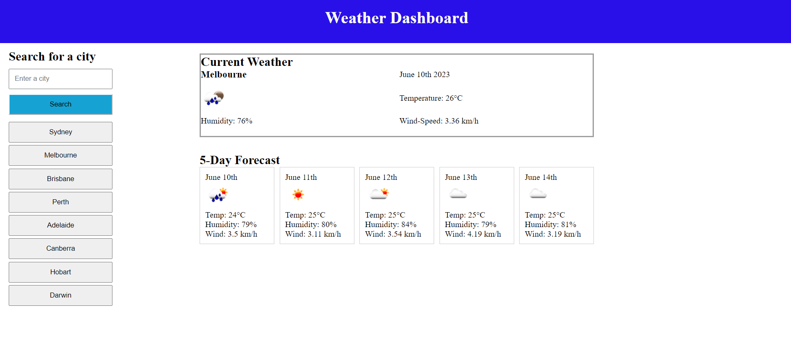

# Weather Dashboard

## Description
This purpose of this project is to create a weather application that allows users to search for the weather forecast of a specific city.
 Data such as temperature, humidity and wind-speed are retrieved using the Open Weather API and displayed on the webpage.

## 
  ## Table of Contents
  - [Installation](#installation)
  - [Usage](#usage)
  - [Contributing](#contributing)
  - [Tests](#tests)
  - [Questions](#questions)
  

## Installation
Visual Studio Code
Open Weather API

## Usage
Upon initialisation, the weather of Perth city will display. The user is able to type any city name and it's weather information will display.
The user's searched cities will remain attached to the search bar using local storage. The buttons provided listing the capital cities
of Perth will display the corresponding weather information at the click of each button.

## License
N/A

## Contributing
Chase Barrett-Brown

## Tests
N/A

## Deployment
https://mrgnoblennon.github.io/Weather-Dashboard/

## Screenshot

## Questions
If you have any questions, feel free to reach out to me:

GitHub: [Mrgnoblennon](https://github.com/Mrgnoblennon)

Email: chasebarrettbrown@hotmail.com

